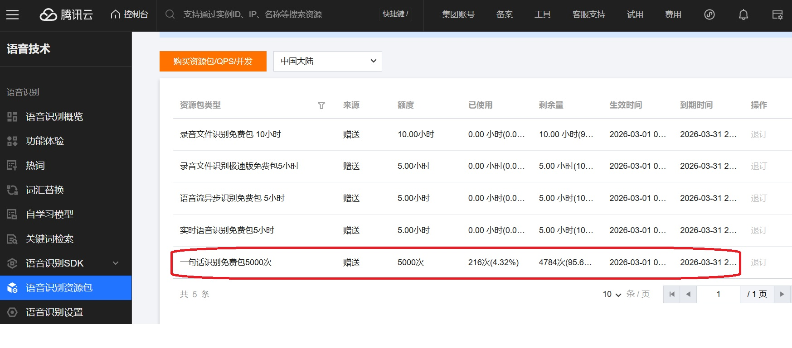

# Voice Input Tray - Rust 版本

> Windows 系統托盤語音輸入工具 - 使用騰訊雲 ASR 將語音即時轉換為文字

## 專案狀態

✅ **已發布 v0.0.2** - 基本功能已完成，包含簡繁轉換與調試模式。

## 為什麼使用這個程式

與市面上其他語音輸入工具相比，Voice Input Tray 解決了三個核心痛點：

### 1. 連續麥克風錄音，隨按隨講不吃字
採用持續監聽技術，按下熱鍵的瞬間即可開始說話，完全沒有啟動延遲。同時，其他應用程式也能同時使用麥克風，不會有麥克風獨佔問題——您可以一邊通話、一邊使用語音輸入。

### 2. 單鍵 CTRL，微秒級啟動，智能判斷使用意圖
只需按住 Ctrl 鍵即開始錄音，程式會自動判斷您的使用意圖：
- 按下 Ctrl 後 2 秒內按其他鍵 → 自動取消，不影響 Ctrl+C、Ctrl+V 等快捷鍵

您再也不會看到「沒有錄到聲音」之類的訊息——從您按下的那一刻起，錄音就已經在進行了；即便取消錄音，也是安靜的處理，不會干擾使用者。

### 3. 騰訊雲自動標點，反應速度更快
內建騰訊雲的自動標點符號功能，識別結果直接帶上標點，無需額外的 LLM 後處理，大幅提升回應速度。

## 功能特色

- **快捷鍵觸發** - 按下自定義熱鍵即可開始錄音，放開自動識別並貼上
- **Ctrl 單鍵模式（預設）** - 按下 Ctrl 即可錄音，2 秒內按其他鍵自動取消（避免干擾 Ctrl+C 等快捷鍵）
- **系統托盤運行** - 背景運行，不干擾日常工作流程
- **即時語音識別** - 使用騰訊雲 ASR 引擎，準確度高
- **自動標點符號** - 輸出結果自動帶上標點符號，無需額外 LLM 處理，速度更快
- **可自訂引擎** - 支援多種 ASR 引擎（普通話、粵語、英文等），可透過托盤選單切換
- **繁簡轉換** - 自動根據系統地區轉換中文繁簡體
- **靈活快捷鍵** - 支援 Ctrl 單鍵、Ctrl+Win、Ctrl+Shift、Ctrl+Alt、Shift+Alt 等組合

## 系統需求

- Windows 10/11
- 麥克風設備
- 騰訊雲 API 憑證

## 下載與安裝

### 1. 下載程式

前往 [Releases 頁面](https://github.com/ascetic168/Voice_Input_Tray/releases/tag/%23voice_input) 下載最新版本的 `voice_input.exe`。

### 2. 驗證檔案完整性

為確保下載的檔案未被篡改，請驗證檔案的 SHA256 雜湊值。

**Windows PowerShell:**
```powershell
Get-FileHash voice_input.exe -Algorithm SHA256
```

**命令提示字元 (CertUtil):**
```cmd
certutil -hashfile voice_input.exe SHA256
```

比對輸出的雜湊值是否與 Releases 頁面中提供的 `SHA256SUMS` 檔案一致。

### 3. 取得騰訊雲 API 憑證

程式需要使用騰訊雲 ASR（語音識別）服務，因此需要先取得 API 憑證。

#### 步驟一：註冊騰訊雲帳號

1. 前往 [騰訊雲官網](https://cloud.tencent.com/) 註冊帳號
2. 支援以下註冊方式：
   - 微信掃碼註冊（推薦，最快）
   - 手機號碼註冊
   - 電子郵件註冊

#### 步驟二：完成實名認證

根據中國大陸法規，使用騰訊雲服務需要完成實名認證：

- **個人認證**：微信已實名認證時，透過微信掃碼即可。
- **企業認證**：需要營業執照或公司登記證明

> 💡 **提示**：如果不想進行中國大陸實名認證，可以使用 [騰訊雲國際版](https://www.tencentcloud.com/)，註冊流程更簡單。

#### 步驟三：開通語音識別服務

1. 登入騰訊雲控制台
2. 搜索或前往「語音識別」產品頁面
3. 開通語音識別服務（通常有免費額度可供測試）



截至撰稿為止，騰訊雲每個月都會送這些免費資源，對於個人來說相當夠用。測試的結果顯示，跨境可以使用非流式的呼叫。

#### 步驟四：取得 API 密鑰（Secret ID 和 Secret Key）

1. 前往 **[雲 API 密鑰控制台](https://console.cloud.tencent.com/cam/capi)**
2. 點擊「**新建密鑰**」按鈕
3. 系統會生成一對密鑰：
   - **SecretId**：類似 `AKIDxxxxxxxxxxxxxxxxxx`
   - **SecretKey**：類似 `xxxxxxxxxxxxxxxxxx`
4. ⚠️ **重要**：SecretKey 只在創建時顯示一次，請立即複製保存！
   - 如果遺失 SecretKey，無法再次查看，只能重新創建新的密鑰

**相關連結：**
- [雲 API 密鑰控制台](https://console.cloud.tencent.com/cam/capi)
- [如何取得雲 API 密鑰 - 腾讯云文档](https://cloud.tencent.com/document/product/598/40489)
- [騰訊雲實名認證指引](https://cloud.tencent.com/document/product/378/10496)

### 4. 設置環境變數

將騰訊雲 API 憑證設置為系統環境變數。若為個人使用，建議設置為**使用者變數**；若同一台機器多人使用，則設置為**系統變數**。

#### 方法一：使用 GUI 設置

1. 按 `Win + R`，輸入 `sysdm.cpl` 並按下 Enter
2. 切換到「進階」分頁，點擊「環境變數」按鈕
3. 在「使用者變數」或「系統變數」區域點擊「新增」
4. 新增以下兩個變數：

   | 變數名稱 | 變數值 |
   |---------|-------|
   | `TENCENTCLOUD_SECRET_ID` | 您的 Secret ID |
   | `TENCENTCLOUD_SECRET_KEY` | 您的 Secret Key |

5. 點擊「確定」儲存設定

#### 方法二：使用命令列設置

**設定使用者變數（推薦）：**
```powershell
setx TENCENTCLOUD_SECRET_ID "your_secret_id_here"
setx TENCENTCLOUD_SECRET_KEY "your_secret_key_here"
```

**設定系統變數（需要管理員權限）：**
```powershell
setx TENCENTCLOUD_SECRET_ID "your_secret_id_here" /M
setx TENCENTCLOUD_SECRET_KEY "your_secret_key_here" /M
```

> **注意：** 設定環境變數後需要重新啟動終端機或重新登入才能生效。

### 5. 執行程式

雙擊 `voice_input.exe` 或在命令列中執行。程式啟動後會在系統托盤顯示藍色麥克風圖示。

## 使用方法

### 啟動程式

**使用預設設定（Ctrl 單鍵，普通話，自動簡繁轉換）：**
```bash
voice_input.exe
```

**使用組合鍵模式：**
```bash
voice_input.exe --key ctrl+win
```

**指定 ASR 引擎：**
```bash
voice_input.exe --engine 16k_yue
```

**簡繁轉換設定：**
```bash
voice_input.exe --convert auto           # 自動檢測系統地區（預設）
voice_input.exe --convert traditional   # 強制轉為正體中文
voice_input.exe --convert none          # 不轉換
```

**啟用調試模式（顯示詳細訊息）：**
```bash
voice_input.exe --debug
```

**查看完整說明：**
```bash
voice_input.exe --help
```

### 托盤選單功能

右鍵點擊托盤圖示可顯示選單：

- **辨識引擎** - 選擇 ASR 引擎（普通話、普通話（視頻）、英文、粵語、川渝方言）
- **關於** - 顯示作者資訊
- **結束程式** - 退出程式

### 支援的快捷鍵組合

| 快捷鍵 | 說明 |
|-------|------|
| `ctrl` | **預設**，Ctrl 單鍵帶 2 秒緩衝期 |
| `ctrl+win` | Ctrl + Windows 鍵 |
| `ctrl+shift` | Ctrl + Shift 鍵 |
| `ctrl+alt` | Ctrl + Alt 鍵 |
| `shift+alt` | Shift + Alt 鍵 |
| `ctrl+f8` | Ctrl + F8 鍵 |
| `ctrl+f6` | Ctrl + F6 鍵 |

#### Ctrl 單鍵模式說明

預設使用 Ctrl 單鍵模式，具有以下特點：

- **按下 Ctrl** → 立即開始錄音（可同時開始說話）
- **在 2 秒內按其他鍵**（如 C、V）→ 自動取消錄音，不影響 Ctrl+C、Ctrl+V 等快捷鍵操作
- **超過 2 秒放開 Ctrl** → 進行語音識別

這個設計讓您可以在不影響日常快捷鍵操作的情況下，隨時使用語音輸入功能。

### 支援的 ASR 引擎

| 引擎代碼 | 說明 |
|---------|------|
| `16k_zh` | 普通話（預設） |
| `16k_zh_video` | 普通話（視頻場景） |
| `16k_en` | 英文 |
| `16k_yue` | 粵語 |
| `16k_ca` | 川渝方言 |

### 簡繁轉換模式

| 模式 | 說明 |
|------|------|
| `auto` | **預設**，自動檢測 Windows 系統地區 |
| | - 正體地區 (zh-TW, zh-HK, zh-MO)：轉換為正體中文 |
| | - 簡體地區 (zh-CN, zh-SG)：不轉換，維持簡體 |
| | - 非中文地區：轉換為正體中文 |
| `traditional` | 強制將辨識結果轉換為正體中文（台灣用詞） |
| `none` | 保持原始辨識結果，不進行轉換 |

### 操作流程

1. 啟動程式後，系統托盤會出現藍色麥克風圖示
2. 按下設定的熱鍵開始錄音（圖示變紅）
   - **Ctrl 單鍵模式**：按下 Ctrl 後可立即說話
     - 在 2 秒內按其他鍵會取消錄音（適用於 Ctrl+C 等快捷鍵）
     - 等待 2 秒後錄音穩定，或直接放開 Ctrl 進行識別
   - **組合鍵模式**：按住組合鍵（如 Ctrl+Win）開始錄音
3. 說話
4. 放開熱鍵停止錄音，系統自動進行語音識別
5. 識別完成的文字會自動貼上到焦點視窗

### 退出程式

- **右鍵選單**：右鍵點擊托盤圖示，選擇「結束程式」
- **快捷鍵**：按下 `Ctrl + Alt + Q`

## 開機自動啟動

### 方法一：使用捷徑

1. 右鍵 `voice_input.exe` → 建立捷徑
2. 按 `Win + R`，輸入 `shell:startup`
3. 將捷徑移動到開啟的資料夾

### 方法二：使用工作排程器

1. 開啟「工作排程器」
2. 創建新任務，觸發器選「使用者登入時」
3. 操作設定為完整路徑的 `voice_input.exe`

## 故障排除

**Q: 程式無法啟動？**
A: 請檢查環境變數 `TENCENTCLOUD_SECRET_ID` 和 `TENCENTCLOUD_SECRET_KEY` 是否正確設定。可在命令列輸入 `echo %TENCENTCLOUD_SECRET_ID%` 確認。

**Q: 無法錄音？**
A: 請確認系統有可用的麥克風設備，且應用程式有權限存取。可使用 `--debug` 參數查看詳細訊息。

**Q: 識別結果不正確？**
A: 嘗試切換不同的 ASR 引擎，或在安靜環境下使用。使用 `--debug` 參數可查看識別過程。

**Q: 想查看詳細執行訊息？**
A: 啟動程式時加上 `--debug` 參數，會顯示控制台視窗並輸出詳細日誌。

**Q: 檔案驗證失敗？**
A: 請確認下載的檔案完整，可能是下載過程中檔案損壞。請重新下載並再次驗證。

## 版本資訊

| 版本 | 發布日期 | 變更說明 |
|------|----------|----------|
| v0.0.2 | 2026-03-23 | 優化貼上延遲，新增引擎選單切換功能 |
| v0.0.1 | 2026-03-20 | 初始發布版本 |

## 授權

本軟體為閉源軟體。版權所有 © 2026 朱國棟 (Charlie Chu)。

未經授權，禁止複製、修改、散布或以任何形式使用本軟體及其相關文件。

---

**作者**：朱國棟 (Charlie Chu)
**聯絡信箱**：charliechu1688@gmail.com
